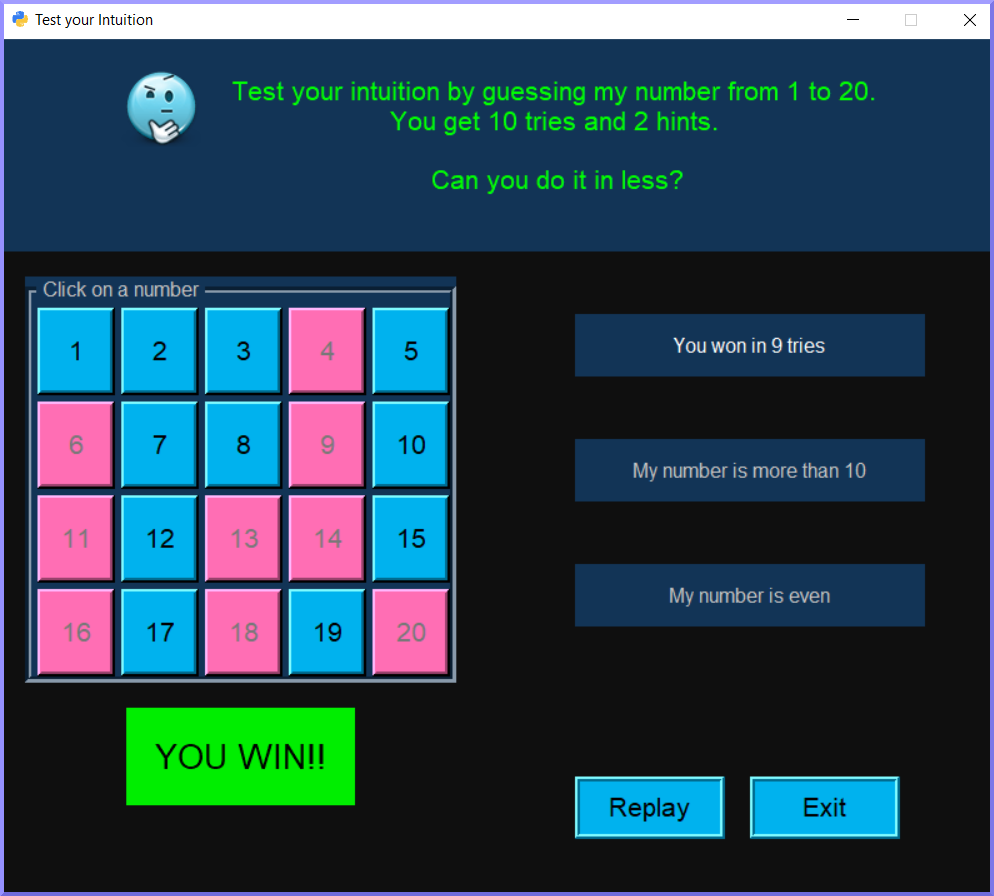

## Guessing Game (GUI version)
This is a number guessing game where user attempts to select the correct number between 1 and 20.  
User gets 10 attempts and 2 hints to win. 
Re-clicking a number is included in the attempt count. 
Exit button - to quit anytime. 
Replay button - appears at the end of each round.

## Hints
- If the number is greater or less than a given value.
- If the number is odd or even.

## Example of game

     
## Additional info
- Uses tkinter for GUI and random module to generate the guess number. 
- Game runs in a loop which consists of 4 main sections;
    -  number pad for user input and exit button (breaks loop)
    -  Win condition
        - reports a Win with a replay option (continues loop)
    -  Lose condition
        - reports a Lose with a replay option (continues loop)
    -  game in progress
        - accepts user inputs, calculates remaining tries, provides hints
- Uses dictionary and conditional statements
- 184 lines of code
- Saved as a Python script
