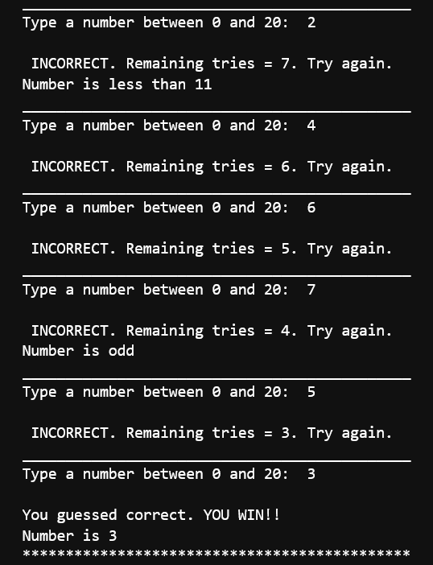

## Guessing Game
This is a simple guessing game where the user has a limited number of attempts to guess the correct whole number between 0 and 20.  
Two hints are given.  
You can quit anytime by entering 'q' or 'Q'. 
Typing in alphabets is forgiven and will NOT be penalized.

## Hints
- If the number is greater or less than a given value.
- If the number is odd or even.

## Example of game

     
## Additional info
- Uses the random module to generate the guess number
- Game runs in a While loop which consists of 4 main sections;
    - 1. user input, error check and abort game
    - 2. Win condition
        - reports a Win and prompts player to play again
    - 3. Lose condition
        - reports a Lose and prompts player to play again
    - 4. game in progress
        - calculates and reports Incorrect with remaining tries, provides hints
- Uses dictionary and conditional statements
- 71 lines of code
- Saved as a Python script
